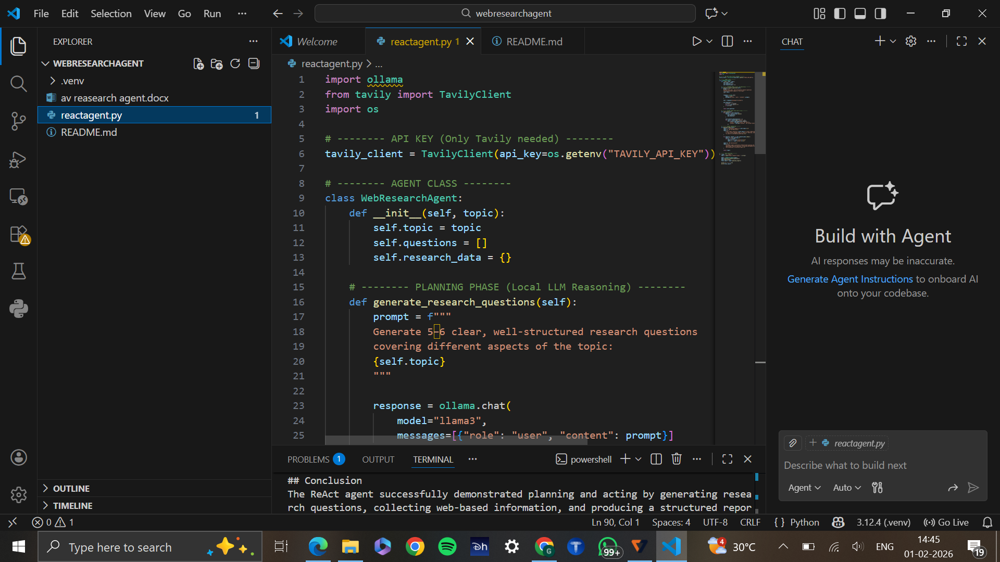
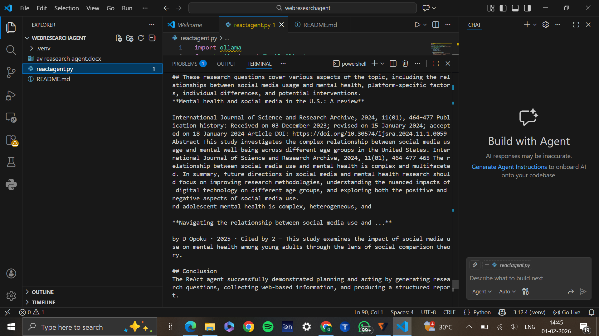

# Web Research Agent using React Pattern

## Project Overview
This project implements a Web Research Agent using the ReAct (Reasoning + Acting) pattern. The agent intelligently plans research questions using a Large Language Model and gathers relevant information from the web using a search tool. The final output is a structured research report.

## Features
- Generates research questions using an LLM (Planning phase)
- Searches the web using Tavily API (Acting phase)
- Compiles a structured report with introduction, findings, and conclusion
- Uses a local LLM to avoid API quota and billing issues

## Technologies Used
- Python
- Ollama (LLaMA 3 – Local Large Language Model)
- Tavily Web Search API

## Architecture
1. User provides a research topic  
2. LLM generates 5–6 research questions  
3. Web search is performed for each question  
4. Results are compiled into a structured report  

## How to Run
1. Install dependencies:
2. Ensure Ollama is installed and the model is pulled:
3. Set the Tavily API key as an environment variable
4. Run the program:

## Output
The program generates a structured research report containing:
- Introduction
- Research questions and findings
- Conclusion

## Conclusion
This project successfully demonstrates the ReAct pattern by integrating reasoning and
tool-based actions to perform intelligent web research.

## Screenshots

### Source Code

### Program Output

